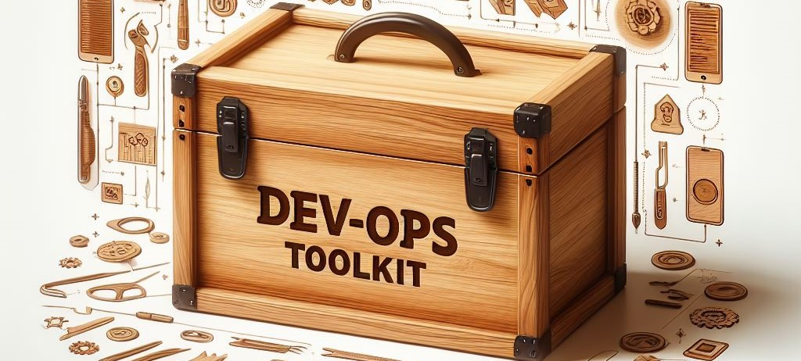

<p align="center">
  <a href="https://github.com/tungbq/devops-toolkit"></a>
</p>

<h1 align="center">DevOps Toolkit</h1>

<p align="center">🐳 Container image for an all-in-one DevOps environment with popular tools like Ansible, Terraform, kubectl, AWS CLI, Azure CLI, Git, Python and more...</p>

<p align="center">
  <a href="https://img.shields.io/github/last-commit/tungbq/devops-toolkit/main"></a>
  <a href="https://github.com/tungbq/devops-toolkit/releases"></a>
  <a href="[https://hub.docker.com/r/tungbq/devops-toolkit/tags](https://github.com/tungbq/devops-toolkit/actions/workflows/deploy-docker-image-release.yml/badge.svg)">
     </a>
  <a href="https://img.shields.io/docker/pulls/tungbq/devops-toolkit"></a>
  <a href="https://github.com/tungbq/devops-toolkit/stargazers"></a>
</p>

## Key features

- **Pre-installed Tools**: Includes a variety of essential tools such as git, python, ansible, terraform, kubectl, helm, awscli, azurecli, etc.
- **Continuous Integration**: Utilizes full CI/CD for deployment to Docker Hub using GitHub Actions.
- **Documentation**: Provides detailed documentation for each tool included.
- **Regular Updates**: Weekly checks and updates for core tools ensure the toolkit's reliability and security.
- **Sample code**: Includes sample code demonstrating the usage of various tools available in the toolkit.
- **Support for Build Variants**: Enables users to customize the toolkit by building it with their preferred versions of each tool.

## Prerequisites 🔓

Before you begin, ensure that you have [Docker](https://docs.docker.com/engine/install/) installed. It's also helpful to have a basic understanding of Docker concepts.

## Versioning 🔖

Below is the versioning strategy for the repository and DockerHub:

- Tagging format:
  - Repository: `vX.Y.Z`, for example: `v1.2.3`
  - DockerHub: `X.Y.Z`, for example: `1.2.3`. (Usage: `docker pull tungbq/devops-toolkit:1.2.3`)
- Tagging description:
  - Specific tag (e.g., v0.1.0, v0.2.3): Contains the latest tooling version and repository features at the time this repository is tagged.
  - In addition to that, we offer the latest tag on DockerHub (latest): Contains the latest tooling version and repository features inside the toolkit, which will be built and updated on a weekly basis.

_NOTE_: In the following section, we use the latest tag in the documentation, but you can specify your desired tag based on your needs.

## Quick start 🔥

```bash
# Use latest tag
docker run --network host -it --rm tungbq/devops-toolkit:latest

# Use specific tag
docker run --network host -it --rm tungbq/devops-toolkit:0.1.0
```

## Demo 📺

Check out the full sample and instruction at [**samples**](./samples/)

```bash
docker run --network host --rm tungbq/devops-toolkit:latest samples/run_sample.sh
```

## Getting started 📖

### Pull the official image from Docker Hub

DockerHub image: [**tungbq/devops-toolkit:latest**](https://hub.docker.com/r/tungbq/devops-toolkit)

```bash
docker pull tungbq/devops-toolkit:latest
```

### Build your own image

Skip this step if you use the image from DockerHub

- If you prefer to build your own image from the source code, refer to the [**build_toolkit_image**](./docs/build/build_toolkit_image.md) instructions.
- We can customize the toolkit by building it with our preferred versions of each tool.

### Start and explore the toolkit container

Once you have the image ready, you can start using the toolkit with the following commands

- Start devops-toolkit container

```bash
docker run --network host -it --rm tungbq/devops-toolkit:latest
```

- Now we are in the docker container terminal, let's explore it

```bash
root@docker-desktop:~# python3 --version
Python 3.12.2

root@docker-desktop:~# terraform --version
Terraform v1.7.5
on linux_amd64

root@docker-desktop:~# kubectl version
Client Version: v1.29.3
Kustomize Version: v5.0.4-0.20230601165947-6ce0bf390ce3

# ... more command as your needed
```

## User guide 📖

Explore the comprehensive guide below to gain insight into the detailed utilization of every tool within the toolkit

- [**DevOps toolkit user guide**](./docs/usage/README.md)

## The DevOps Toolkit Core 🧰

Built on `ubuntu:22.04` base image

| Name      | Version                 | Release                                                                      | Usage                                              |
| :-------- | :---------------------- | :--------------------------------------------------------------------------- | :------------------------------------------------- |
| Python    | PYTHON_VERSION=3.11     | [Check](https://www.python.org/downloads/source/)                            | [python_usage](./docs/usage/python_usage.md)       |
| Ansible   | ANSIBLE_VERSION=2.17.1  | [Check](https://api.github.com/repos/ansible/ansible/releases/latest)        | [ansible_usage](./docs/usage/ansible_usage.md)     |
| Terraform | TERRAFORM_VERSION=1.9.1 | [Check](https://releases.hashicorp.com/terraform/)                           | [terraform_usage](./docs/usage/terraform_usage.md) |
| Kubectl   | KUBECTL_VERSION=1.30.2  | [Check](https://dl.k8s.io/release/stable.txt)                                | [kubectl_usage](./docs/usage/kubectl_usage.md)     |
| Helm      | HELM_VERSION=3.15.2     | [Check](https://github.com/helm/helm/releases)                               | [helm_usage](./docs/usage/helm_usage.md)           |
| AwsCLI    | AWSCLI_VERSION=2.17.9   | [Check](https://raw.githubusercontent.com/aws/aws-cli/v2/CHANGELOG.rst)      | [awscli_usage](./docs/usage/awscli_usage.md)       |
| AzureCLI  | AZURECLI_VERSION=2.61.0 | [Check](https://learn.microsoft.com/en-us/cli/azure/release-notes-azure-cli) | [azurecli_usage](./docs/usage/azurecli_usage.md)   |

And more tools to be implemented...

## Contributing

- See: [CONTRIBUTING.md](./CONTRIBUTING.md)
- Looking for the issue to work on? Check the list of our open issues [**good first issue**](https://github.com/tungbq/devops-toolkit/issues?q=is%3Aissue+is%3Aopen+label%3A%22good+first+issue%22)
- Feel free to open a new issue if you encounter the toolkit bug or want to request more content about DevOps toolkit
- Submit a [new issue](https://github.com/tungbq/devops-toolkit/issues/new) (🐛) if you encounter the bug/error when using this toolkit

## Hit the Star! ⭐

- If you find this repository helpful, kindly consider showing your appreciation by giving it a star ⭐ Thanks! 💖
